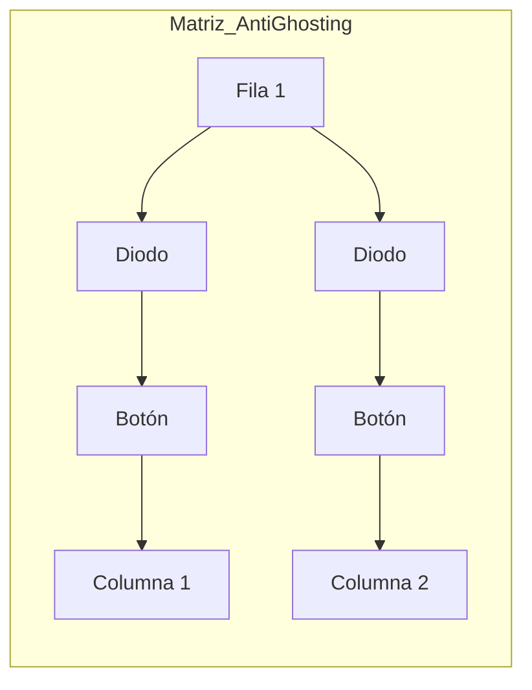

# 🪗 GUÍA MAESTRA: ACORDEÓN DIGITAL PROFESIONAL (V1.0)

Este documento detalla la arquitectura técnica para convertir un acordeón **Hohner** original en un sistema MIDI/Digital de alta fidelidad, basándose en el análisis de hardware profesional y los prototipos actuales.

---

## 1. 🔍 ANÁLISIS DE HARDWARE (REFERENCIA PROFESIONAL)

Basado en las imágenes de la competencia (REHBER) y los requerimientos de Jesús:

### 🎹 Matriz de Botones (Imagen 1 y 4)
*   **Anti-Ghosting (Diodos)**: La competencia usa diodos (probablemente **1N4148**) en cada botón. Esto es vital. Sin diodos, al presionar más de 3 botones (acordes), se producen "notas fantasma". 
*   **Mecánica**: Usar el diapasón y resortes originales Hohner garantiza la "pegada" vallenata. Los pulsadores deben ser de perfil bajo y ultra-sensibles.
*   **Cableado**: Usan cables tipo **Ribbon** (gris plano) para mantener el orden. En el modelo final, usaremos conectores IDC para que puedas desconectar el diapasón del mueble fácilmente.

### 🧠 Procesamiento y Memoria (Imagen 2 y 3)
*   **Módulo Central**: Usan un Arduino Nano/Micro para el escaneo de teclas. 
*   **Nuestra Mejora**: Nosotros usaremos el **ESP32-S3**. Es 10 veces más potente, tiene Bluetooth MIDI nativo y memoria suficiente para cargar muestras de audio sin latencia.

---

## 2. 🛡️ ARQUITECTURA ELECTRÓNICA RECOMENDADA

Para que el acordeón sea "rompecuellos", necesitamos estos componentes:

### A. El Cerebro (Controlador)
*   **ESP32-S3 N16R8**: El estándar de oro. Tiene 16MB de memoria para que el acordeón suene solo (standalone) si quieres.

### B. El Fuelle (Sensor de Presión Real)
*   **MS5803-01BA**: Olvida el ultrasonido para el fuelle de cuero. Este sensor mide la presión del aire *dentro* del mueble. Si aprietas duro, el sonido sube; si halas suave, el sonido baja. Es lo que da el "sentimiento" al vallenato.

### C. Audio Interno (El corazón del sonido)

¿Es el **PCM5102A** el mejor? Es el **mejor balance** entre calidad profesional y facilidad. Pero si buscas el nivel "Dios" del audio, aquí tienes la comparativa:

| Característica | **PCM5102A** (Recomendado) | **ES9038Q2M (SABRE)** (Audiófilo) |
| :--- | :--- | :--- |
| **Calidad** | 32-bit / 384kHz | 32-bit / 768kHz |
| **Fidelidad (SNR)** | 112 dB (Excelente) | **129 dB (Insanamente limpio)** |
| **Dificultad** | Fácil (No requiere configuración) | **Dificultad Alta** (Requiere programación I2C) |
| **Uso** | Instrumentos Pro, Consolas | Equipos de High-End, DACs de $500 USD |

> [!TIP]
> **Mi veredicto para Jesús:** Para un acordeón con bocinas internas, el **PCM5102A** es perfecto. El ES9038 es "mejor" técnicamente, pero esa diferencia solo la notarías con audífonos de $1,000 dólares. El PCM5102A te dará un sonido profesional sin complicarte la vida con el diseño de la placa.

### D. Amplificación Clase D (Para las bocinas)
Para que el acordeón suene fuerte y claro dentro de la madera:
*   **TPA3116D2**: Potencia pura (50W+50W). Hará que el acordeón "peque" duro. 
*   **TPA3118**: Una opción más eficiente que calienta menos, ideal si usas batería.

### E. Almacenamiento: ¿Dónde viven los sonidos? 💾

Para un acordeón profesional, usaremos una **Arquitectura de 3 Niveles**:

1.  **Memoria Flash (16MB)**: Aquí vive el "cerebro" (el código). Es ultra rápida pero pequeña.
2.  **Tarjeta Micro SD (Externa)**: Aquí guardaremos los archivos `.wav` de tus acordeones. Puedes tener tarjetas de 32GB con miles de sonidos. El ESP32-S3 leerá las carpetas directamente de la SD.
3.  **PSRAM (8MB)**: Es la memoria RAM. El ESP32-S3 carga los primeros milisegundos de cada nota de la SD a la PSRAM para que cuando tú toques un botón, el sonido salga **instantáneamente** sin esperar a que la SD responda.

---

## 5. 🏆 SELECCIÓN DEFINITIVA "BEST-IN-CLASS"

Si quieres armar el mejor acordeón del mundo hoy mismo, compra exactamente esto:

| Componente | Modelo Específico | ¿Por qué este? |
| :--- | :--- | :--- |
| **Cerebro** | **ESP32-S3-DevKitC-1 (N16R8)** | Tiene 16MB de Flash y 8MB de PSRAM. Es el único que aguanta audio pro. |
| **Fuelle** | **MS5803-01BA** | Sensor suizo de alta precisión. Detecta hasta un suspiro en el fuelle. |
| **Audio** | **PCM5102A (I2S)** | 32-bit de resolución. Calidad de CD y súper fácil de conectar. |
| **Amplificador** | **TPA3116D2** | El más potente para mover bocinas de 3 o 4 pulgadas con fuerza. |
| **Memoria** | **Micro SD SPI Module** | Para cargar tus propios bancos de sonido personalizados. |
| **Energía** | **Batería LiPo 3S (11.1V)** | Necesitas voltaje alto para que el amplificador suene vallenato de verdad. |

---

## 3. 📐 DISEÑO DEL CIRCUITO (MATRIZ CON DIODOS)

Para los botones reales Hohner, la PCB debe seguir este esquema:

> [!IMPORTANT]
> **Diodos 1N4148**: Deben ir en serie con cada botón para que puedas hacer trinos rápidos y acordes complejos sin que el sistema se bloquee.

---

## 4. 🚀 PRÓXIMOS PASOS (HOJA DE RUTA)

1.  **Diseño de PCB**: Crear dos placas. Una larga para el diapasón (pitos) y una cuadrada para los bajos.
2.  **Montaje en Madera**: Instalar los botones originales sobre la PCB.
3.  **Calibración de Fuelle**: Instalar el sensor de presión MS5803 en una válvula interna del mueble.
4.  **Standalone**: Agregar un amplificador clase D y dos bocinas de neodimio dentro del mueble de madera.

---

## 🛠️ LISTA DE COMPRAS "PRO" (LINK DE REFERENCIA)
*   [ ] ESP32-S3 N16R8 (Cerebro)
*   [ ] MS5803-01BA (Sensor de Presión Barométrica)
*   [ ] PCM5102A (DAC de Audio Pro)
*   [ ] Diodos 1N4148 (x50 unidades para los botones)
*   [ ] Conectores JST/IDC (Para cableado flexible)

---
*Documento generado por Antigravity para Jesús González - Academia Vallenata Online*
